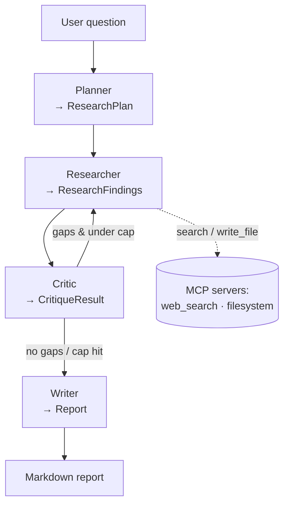

# Multi-Agent Research Assistant

> Ask a research question. Four specialist agents — **planner → researcher →
> critic → writer** — coordinate via structured Agent-to-Agent (A2A) messages to
> produce a well-cited markdown report. The researcher pulls real sources through
> **MCP** tools, a critic loop closes gaps, and every step is traced in
> **LangSmith** with per-agent latency / token / cost metrics.

**Stack:** Python 3.11 · uv · LangGraph · Pydantic v2 · MCP (official SDK) ·
LangSmith · OpenAI (one-line swap to Anthropic)

<!-- 🎥 DEMO VIDEO: <PASTE UNLISTED LOOM/YOUTUBE LINK HERE> -->
> **▶️ Demo video:** _add link_ — see [Demo](#demo) for what it shows.

## Architecture



Every arrow is a **Pydantic-validated A2A message**. The planner→researcher→critic
loop is the canonical "deep research" pattern; the critic loop is capped at 3
cycles. Full walkthrough in [docs/architecture.md](docs/architecture.md).

| Capability | Where |
|---|---|
| A2A messaging (typed) | `src/research_assistant/messages.py` |
| LangGraph orchestration + critic loop | `src/research_assistant/graph.py` |
| Specialist agents | `src/research_assistant/agents/` |
| MCP tools (web search, filesystem) | `src/research_assistant/mcp_servers/`, `mcp_client.py` — [docs/mcp.md](docs/mcp.md) |
| LangSmith tracing + per-agent metrics | `src/research_assistant/observability.py` |
| Evals (golden set + LLM-as-judge) | `evals/` |

## Status

- [x] **Phase 1** — Skeleton + Pydantic A2A schemas + LangGraph wiring
- [x] **Phase 2** — Real LLM calls with structured outputs + LangSmith auto-tracing
- [x] **Phase 3** — MCP servers (Tavily web search + sandboxed filesystem) + retrieval-grounded citations
- [x] **Phase 4** — Observability metrics + evals + docs _(demo video/screenshots pending)_

## Try it locally

```bash
git clone <repo>
cd "Multi-Agent Research Assistant"
cp .env.example .env   # add OPENAI_API_KEY, TAVILY_API_KEY, LANGSMITH_API_KEY
uv sync
uv run research "What are the tradeoffs of multi-agent vs single-agent LLM systems?"
```

The report prints to stdout; a per-agent latency/token/cost table is logged to
stderr. With `LANGSMITH_TRACING=true`, open the LangSmith project to see the
nested trace.

## Observability

Per-agent latency, token usage, and estimated cost are captured every run and
summarized:

```
| Agent     | Calls | Latency (s) | In tok | Out tok | Cost (USD) |
|-----------|------:|------------:|-------:|--------:|-----------:|
| planner   |     1 |        1.42 |    310 |     180 |  $0.00015  |
| researcher|     2 |        4.10 |   2950 |     520 |  $0.00075  |
| critic    |     2 |        1.88 |   1400 |     240 |  $0.00036  |
| writer    |     1 |        2.55 |   1600 |     600 |  $0.00060  |
| total     |     6 |        9.95 |   6260 |    1540 |  $0.00186  |
```

Details + LangSmith trace anatomy: [docs/observability.md](docs/observability.md).

## Evaluation

A 10-question golden set (`evals/golden_set.jsonl`) is scored by an **LLM-as-judge
on a different model** (`gpt-4o` judging `gpt-4o-mini`) across relevance,
coverage, citation-quality, and hallucination:

```bash
uv run python evals/run_eval.py            # full suite (needs API keys)
uv run python evals/run_eval.py --limit 3  # quick smoke test
```

Results are written to `evals/results/` as JSON + a markdown table (`latest.md`).

<!-- EVAL RESULTS: paste the latest.md table here after a run. -->
> _Run the suite and paste the results table here._

## Demo

<!-- Embed screenshots in docs/ or an assets/ folder and link them here. -->
The demo lives in artifacts (this project has no hosted instance by design):

1. **Walkthrough video** — CLI invocation → structured planner output → researcher
   hitting MCP web search → critic loop firing → final report → LangSmith trace tree.
2. **Screenshots** — _(add)_ LangSmith nested trace · a sample report · the eval table.

## Development

```bash
uv sync          # install deps + dev group
uv run pytest    # full test suite (no network: mocked LLM + key-free MCP server)
```

## Docs

- [Architecture](docs/architecture.md) — components, graph, data flow
- [Design decisions](docs/design_decisions.md) — every choice + trade-off
- [MCP tools](docs/mcp.md) — servers, capability scoping, citation grounding
- [Observability](docs/observability.md) — traces + metrics
