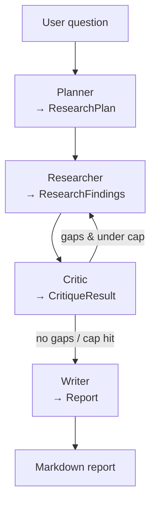

# Multi-Agent Research Assistant

> Give it a research question. Four specialist agents — **planner → researcher → critic → writer** — coordinate via structured Agent-to-Agent (A2A) messages to produce a well-cited markdown report. Every agent step, tool call, and LLM call is traceable in LangSmith.

<!-- 🎥 DEMO VIDEO: <link> — pinned here above everything else (added in Phase 4). -->

## Architecture



Every arrow is a **Pydantic-validated A2A message** (`src/research_assistant/messages.py`). The
planner→researcher→critic loop is the canonical "deep research" pattern; the
critic loop is capped at 3 cycles.

| Capability | Where |
|---|---|
| A2A messaging (typed) | `src/research_assistant/messages.py` |
| LangGraph orchestration + loop | `src/research_assistant/graph.py` |
| Specialist agents | `src/research_assistant/agents/` |
| MCP tools (web search, filesystem) | `src/research_assistant/mcp_servers/`, `mcp_client.py` _(Phase 3)_ |
| LangSmith tracing + per-agent metrics | `src/research_assistant/observability.py` _(Phase 2/4)_ |

## Status

- [x] **Phase 1** — Skeleton + Pydantic A2A schemas + LangGraph wiring (stub agents, no LLM)
- [x] **Phase 2** — Real LLM calls with structured outputs + LangSmith auto-tracing
- [ ] **Phase 3** — MCP servers + real tool calls + citations
- [ ] **Phase 4** — Observability metrics + evals + demo artifacts + docs

## Try it locally

```bash
git clone <repo>
cd "Multi-Agent Research Assistant"
cp .env.example .env   # add OPENAI_API_KEY, LANGSMITH_API_KEY, TAVILY_API_KEY
uv sync
uv run research "your question here"
```

> Phase 1 runs entirely on stub agents — no API keys required yet.

## Development

```bash
uv sync            # install deps + dev group
uv run pytest      # run the test suite (no network calls)
```

## Docs

- [Architecture](docs/architecture.md)
- [Design decisions](docs/design_decisions.md)
- [Observability](docs/observability.md)
