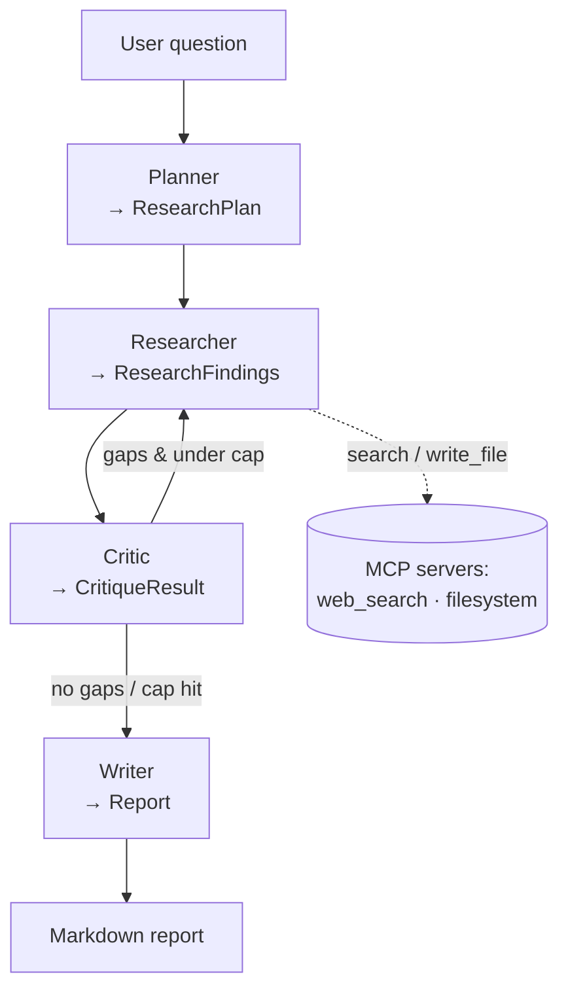

# Architecture

A research question goes in; a cited markdown report comes out. Four specialist
agents coordinate over a LangGraph state machine, passing **typed Pydantic A2A
messages**. The researcher reaches the web and disk only through **MCP tools**,
and every step is traced in **LangSmith**.

## The agents

| Agent | Input → Output | Responsibility |
|-------|----------------|----------------|
| **Planner** | `PlannerInput` → `ResearchPlan` | Decompose the question into ordered, independent steps. |
| **Researcher** | `ResearcherInput` → `ResearchFindings` | Search per step via MCP, synthesize findings, attach real citations. |
| **Critic** | `CriticInput` → `CritiqueResult` | Score coverage/citations; emit gaps to trigger another loop. |
| **Writer** | `WriterInput` → `Report` | Synthesize plan + findings into the final cited report. |

All four subclass `BaseAgent[InputT, OutputT]` — one async `run`, one typed in,
one typed out. The shared LLM call path (structured output + metrics) lives in
`BaseAgent._complete`.

## The graph (`graph.py`)

The graph is a thin coordinator: each node calls one injected agent and writes
its typed result into `GraphState`. The only branch is **after the critic**:

- `critique.has_gaps` **and** `iteration < max_iterations` → loop back to the researcher
- otherwise → writer → END

Two independent guarantees keep the loop safe: the **critic decides intent**
(whether gaps remain) while the **graph enforces budget** (`max_iterations`, default 3).

## A2A contract (`messages.py`)

Every arrow in the diagram is a Pydantic v2 model with `extra="forbid"`. Nothing
untyped crosses an agent boundary, and the same models double as the LLM's
structured-output schemas — so a malformed generation fails validation loudly
instead of propagating a bad dict.

## Tools via MCP (`mcp_servers/`, `mcp_client.py`)

The researcher calls `search` and `write_file` through MCP servers spawned over
stdio — never direct API calls. Citations are **retrieval-grounded**: the model
selects sources by index from what search returned, so it cannot invent a URL.
Capability scoping (filesystem sandbox, search bounds) is documented in
[mcp.md](mcp.md).

## Observability (`observability.py`)

LangChain/LangGraph runnables auto-trace to LangSmith, producing a nested tree
(graph → agent → LLM/tool call). On top of that, `_complete` records per-agent
latency, token usage, and estimated cost, summarized as a table at the end of a
run. See [observability.md](observability.md).

## Entry point

`cli.py` (`research "question"`) configures logging + tracing, opens the MCP tool
lifecycle via `run_research`, runs the graph to completion, prints the report to
stdout, and logs the metrics table to stderr.
